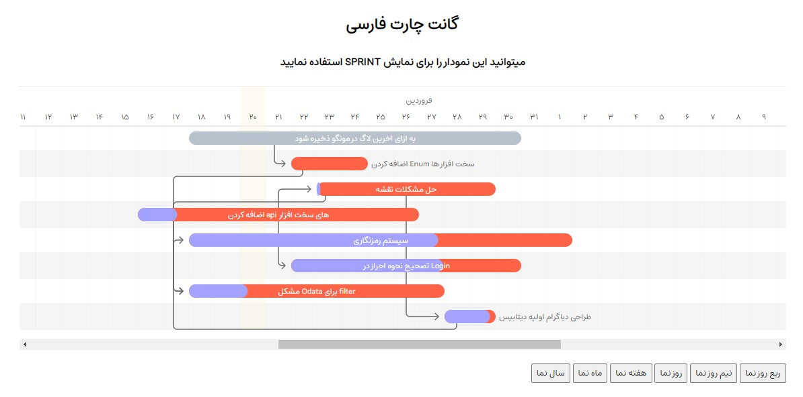

<div align="center">
    <h2>نمودار گانت شمسی</h2>
    <p align="center">
        <p>کتابخانه رایگان و آسان ایجاد نمودار گانت و اسپرینت شمسی</p>
        <a href="https://frappe.github.io/gantt">
            <b>مشاهده نسخه اصلی</b>
        </a>
    </p>
</div>

<p align="center">
        
</p>

اضافه کردن وظیفه ها
```js
var tasks = [
  {
    id: 'Task 1',
     start: '2023-04-07',
     end: '2023-04-21',
     name: 'سیستم رمزنگاری',
     id: "Task 5",
     progress: 65,
      avatars: ["https://avatars.githubusercontent.com/u/27079323?v=4","https://avatars.githubusercontent.com/u/27079323?v=4"],
     dependencies: 'Task 8',
     custom_class: 'bar-milestone' // optional
  },
  ...
]
var gantt = new Gantt("#gantt", tasks);
```

------------------
تولید شده توسط [احمد قنواتی](https://github.com/Ghanavati7915)
